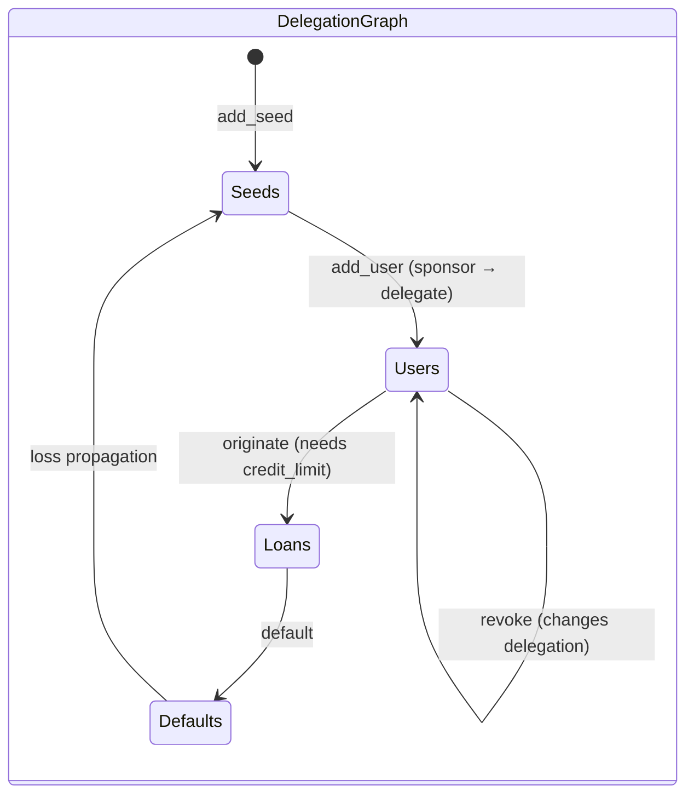
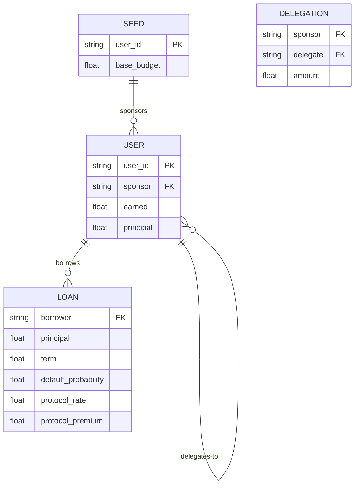
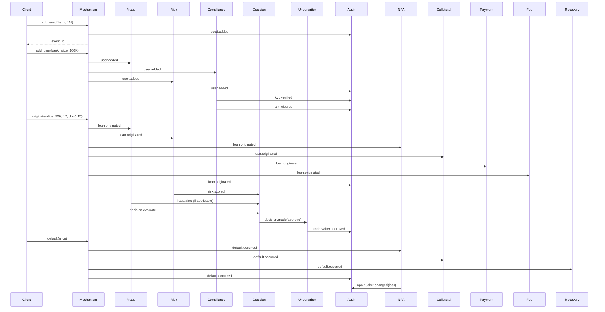

# Domain Model — underwrite

## Core Entities

The protocol state machine lives in `DelegationGraph` (`underwrite/services/mechanism/graph.py`) — a pure, testable domain model with no infrastructure dependencies.

| Entity | Type | Description |
|---|---|---|
| **Seed** | `set[str]` | Root participants with a `base_budget` (e.g. banks providing capital). Added via `add_seed(user, budget)`. |
| **User** | `dict[str, float]` (earned) | Non-seed participant, added via sponsor relationship (`add_user(sponsor, user, amount)`). Every user has `earned`, `principal`, and a parent sponsor. |
| **Delegation** | `dict[tuple[str,str], float]` | Directed edge `sponsor → delegate` with an allocated amount. Outgoing delegations consume credit limit. |
| **Credit Limit** | computed | `budget + earned - outgoing_delegations`. For non-seeds, `budget` = incoming delegation amount. |
| **Loan** | `dict[str, list[...]]` | Originated against available credit. Carries `principal`, `term`, `default_probability`, `protocol_rate`, `protocol_premium`. |
| **Required Delegation** | computed recursively | Minimum delegation a user needs to maintain solvency: `max(0, principal + sum(child_required) - earned)`. Max depth = 50. |
| **Default** | cascading loss | Loss propagates up the chain: borrower's `earned` → sponsor's delegation edge → seed `base_budget`. |
| **Path to Seed** | `list[str]` | Delegation chain with cycle detection; reversed so index 0 is the seed. |

### Credit Limit Formula

```
credit_limit(user) =
    if user is seed:      base_budget[user] + earned[user] - sum(outgoing_delegations)
    if user is non-seed:  delegation[(sponsor, user)] + earned[user] - sum(outgoing_delegations)
```

### Default Propagation

```
loss = min(principal[borrower], MAX)
1. absorb from borrower.earned
2. propagate remaining loss up to sponsor:
   a. absorb from sponsor.earned
   b. if loss remains, reduce delegation( sponsor → current )
3. if loss reaches a seed, deduct from seed.base_budget
```

### Domain State Diagram



### ER Diagram



## Domain Events

All 80+ event types are defined as an `EventType` enum in `underwrite/__events__.py:62`. Convention: `<domain>.<action>[.<outcome>]`.

### Core
| Event | Trigger |
|---|---|
| `seed.added` | `add_seed` command processed |
| `user.added` | `add_user` command processed |
| `loan.originated` | Loan originated against credit limit |
| `repaid` | Repayment applied |
| `default.occurred` | Default processed, loss propagated |
| `revoked` | Delegation edge amount changed |

### Quote / Pricing
| Event | Trigger |
|---|---|
| `quote` | Raw quote request |
| `quote.calculated` | Break-even rate computed |
| `pricing.computed` | Price set |
| `pricing.request` | Quote → pricing hand-off |

### KYC / AML
| Event | Trigger |
|---|---|
| `kyc.verified` | PAN + Aadhaar valid |
| `kyc.rejected` | Invalid PAN or Aadhaar |
| `kyc.video_initiated` | Video KYC session started |
| `kyc.video_verified` | Video KYC completed successfully |
| `aml.cleared` | Low-risk: AML score below threshold |
| `aml.flagged` | Medium-risk: AML score warrants review |
| `aml.frozen` | High-risk: AML score above freeze threshold |

### CKYC / Credit Bureau
| Event | Trigger |
|---|---|
| `ckyc.verify` | Initiate CKYC registry lookup |
| `ckyc.verified` | CKYC identity matched |
| `ckyc.rejected` | CKYC identity mismatch |
| `credit_bureau.check` | Credit report requested |
| `credit_bureau.checked` | Credit report received with score |
| `credit_bureau.check_failed` | Bureau API error |

### Consent (DPDPA)
| Event | Trigger |
|---|---|
| `consent.recorded` | Consent granted for a purpose |
| `consent.withdrawn` | Consent withdrawn by data subject |
| `consent.expired` | Consent period ended |

### DSR (Data Subject Rights)
| Event | Trigger |
|---|---|
| `dsr.request` | DSR submitted by data subject |
| `dsr.requested` | DSR forwarded for fulfillment |
| `dsr.fulfilled` | DSR completed within 30-day window |
| `dsr.rejected` | DSR denied with rationale |

### KFS (Key Fact Statement)
| Event | Trigger |
|---|---|
| `kfs.generate` | KFS generation requested |
| `kfs.generated` | KFS document produced with full disclosure |

### Pricing (RBI Compliant)
| Event | Trigger |
|---|---|
| `pricing.request` | Rate/fee computation requested |
| `pricing.computed` | Price set with APR, EMI, fees |
| `penal_interest.assessed` | Penal interest applied on overdue |
| `foreclosure.computed` | Foreclosure charges calculated |

### Prepayment / Provisioning / SMA
| Event | Trigger |
|---|---|
| `prepayment.request` | Prepayment initiated by borrower |
| `prepayment.processed` | Prepayment completed with charges |
| `provisioning.computed` | NPA provisioning amount calculated |
| `sma.classified` | SMA-0/1/2 classification assigned |
| `income_recognition.suspended` | Income recognition suspended for NPA |

### Data Protection / Breach
| Event | Trigger |
|---|---|
| `breach.detected` | Potential data breach identified |
| `breach.notified` | Breach notification sent to DPB/authority |
| `breach.closed` | Breach investigation closed |
| `grievance.logged` | Complaint/grievance received |
| `grievance.resolved` | Grievance resolved |
| `data.purged` | Expired data purged per retention policy |
| `data.archived` | Historical data archived |

### Razorpay (PG)
| Event | Trigger |
|---|---|
| `razorpay.order.create` | Payment order creation to Razorpay |
| `razorpay.order.created` | Razorpay order confirmed |
| `razorpay.payment.captured` | Payment successfully captured |
| `razorpay.payment.failed` | Payment failed |
| `razorpay.payment.refunded` | Payment refunded |
| `razorpay.subscribe` | Mandate/e-NACH subscription created |
| `razorpay.subscription.created` | Subscription active |
| `razorpay.subscription.charged` | Recurring charge collected |
| `razorpay.subscription.failed` | Recurring charge failed |
| `razorpay.mandate.active` | e-NACH mandate activated |
| `razorpay.mandate.inactive` | e-NACH mandate deactivated |
| `razorpay.webhook.received` | Razorpay webhook event received |

### Fraud
| Event | Trigger |
|---|---|
| `fraud.alert` | Large origination (>1M) |
| `fraud.wash.flag` | 3+ origination/repayment cycles |
| `fraud.velocity.flag` | 3+ originations in window |

### Risk
| Event | Trigger |
|---|---|
| `risk.scored` | ML model score computed |
| `risk.early_warning` | Default probability > 0.30 |

### NPA
| Event | Trigger |
|---|---|
| `npa.bucket.changed` | Days-past-due crosses threshold |
| `npa.dlg.triggered` | 120+ days overdue triggers DLG |

### Collateral
| Event | Trigger |
|---|---|
| `collateral.marked` | LTV computed on origination |
| `collateral.liquidated` | Collateral sold on default |

### Governance
| Event | Trigger |
|---|---|
| `governance.proposal` | Parameter change proposed |
| `governance.executed` | Proposal accepted and applied |

### Recovery / Identity / Notification / Reporting / Underwriting / Document / Disbursement / Collection / Settlement / Origination / Servicing / Payment / Fee / Statement / Communication / Workflow / Decision / Graph / Mechanism / Saga / Idempotency

Full registry in `underwrite/__events__.py`. Includes:
- `identity.register`, `identity.rotate`
- `underwrite.request`, `underwriter.approved`, `underwriter.rejected`
- `payment.receive`, `payment.schedule`, `payment.check_overdue`
- `workflow.start`, `workflow.advance`
- `decision.evaluate`, `decision.made`
- `saga.started`, `saga.completed`, `saga.rolled_back`, `saga.compensate`
- `idempotency.duplicate_dropped`
- Graph queries: `graph_path`, `graph_credit_limit`, `graph_users` (+ `_result` variants)
- `mechanism.rejected`

### Event Envelope

```python
@dataclass(frozen=True, slots=True)
class Event:
    event_id: str        # uuid4
    event_type: str      # e.g. "loan.originated"
    source: str          # service_id of emitter
    source_key: str      # Ed25519 public key
    timestamp: str       # ISO-8601 UTC
    payload: dict        # max 1000 keys, 1 MB serialized
    correlation_id: str  # uuid4 chain
    signature: str       # Ed25519 sig over event_id:timestamp:event_type:payload
    trace_id: str
    parent_span_id: str
```

### Event Flow Diagram



## Service Responsibilities

### MechanismService
`underwrite/services/mechanism/service.py` — The protocol state machine. Owns the `DelegationGraph`, processes commands (`add_seed`, `add_user`, `originate`, `repay`, `default`, `revoke`, `quote`), and emits domain events. Uses snapshot/rollback pattern: state is serialized to store on every mutation; on write failure, in-memory state is restored.

Commands arrive as service-name events — i.e. events with `event_type == "mechanism"` and a `command` field in the payload. Unknown commands are silently dropped. Protocol violations emit `mechanism.rejected`.

### AuditService
`underwrite/services/audit/service.py` — Append-only event ledger. Subscribes to almost every domain event and maintains an ordered ledger. Configurable `max_ledger` cap with optional `export_url` for offloading. Every event that any other service emits is tracked here.

### RiskService
`underwrite/services/risk/service.py` — Computes default-probability scores. Optionally integrates with sklearn `RiskModel` (controllable via `RISK_MODEL_PATH` env var). Emits `risk.scored` with the model's score, and `risk.early_warning` if `default_probability > 0.30`.

### FraudService
`underwrite/services/fraud/service.py` — In-memory activity tracking with batched store persistence. Maintains `OrderedDict[str, deque]` of borrower activity records (max 100K borrowers, 1000 entries per borrower). Rules:
- **Wash lending**: 3+ alternating origination/repayment cycles → `fraud.wash.flag` with score
- **Velocity**: 3+ originations total → `fraud.velocity.flag`
- **Large origination**: Principal > 1,000,000 → `fraud.alert` with rule `"large_origination"`

### ComplianceService
`underwrite/services/compliance/service.py` — Indian KYC/AML compliance. Validates PAN format with category detection (Individual/Company/Firm/Trust/HUF etc.) and Aadhaar Verhoeff check-digit verification (not just regex). AML screening uses weighted keyword matching for PEPs, sanctions, fraud flags, and terror financing. Returns one of three states:
- **cleared** — low risk (score < threshold)
- **flagged** — medium risk, needs manual review
- **frozen** — high risk, blocked

Emits:
- `kyc.verified` on PAN + Aadhaar format pass
- `kyc.rejected` on validation failure
- `aml.cleared` / `aml.flagged` / `aml.frozen` based on risk score
- `ckyc.verify` to initiate CKYC registry lookup
- `kyc.video_initiated` when video KYC is triggered
- `kyc.video_verified` on video KYC completion

Also performs consent pre-check before initiating KYC, emitting `consent.expired` if consent is needed.

### DecisionService
`underwrite/services/decision/service.py` — Signal aggregation. Collects signals from fraud, risk, and compliance for a given entity. On `decision.evaluate`:
- Any `high` severity signal → `reject`
- 3+ `medium` signals → `escalate`
- 1-2 `medium` signals → `review`
- No signals → `approve`

### UnderwriterService
`underwrite/services/underwriter/service.py` — Loan application evaluation. Rejects if `default_probability > 0.25` or `principal <= 0`.

### FeeService
`underwrite/services/fee/service.py` — Fee assessment with configurable schedules. Default schedules:

| Fee Type | Amount | Notes |
|---|---|---|
| `late_payment` | 25.0 (flat) | Assessed on `payment.overdue` |
| `origination` | 0.01 (1% of principal) | Assessed on `fee.assess` |
| `prepayment` | 0.005 (0.5%) | Assessed on `fee.assess` |
| `service` | 5.0 (flat) | Assessed on `fee.assess` |

### NPAService
`underwrite/services/npa/service.py` — RBI NPA classification. Buckets:

| Bucket | Days Past Due |
|---|---|
| `standard` | 0–90 |
| `substandard` | 91–180 |
| `doubtful` | 181–360 |
| `loss` | >360 |

DLG (Default Loss Guarantee) triggers at 120+ days overdue, emitting `npa.dlg.triggered`.

### CollateralService
`underwrite/services/collateral/service.py` — LTV tracking. On origination, marks collateral at `ltv_ratio = 0.75` (75%). On default, liquidates and emits `collateral.liquidated`.

### PaymentService
`underwrite/services/payment/service.py` — Payment scheduling, receipt, and overdue detection. Uses `payment.schedule`, `payment.receive`, `payment.check_overdue` commands. Overdue detection uses a 30-day cutoff. Integrates with Razorpay for UPI Autopay and e-NACH mandate collection.

### PricingService
`underwrite/services/pricing/service.py` — RBI-compliant interest rate and fee computation. Enforces per-product rate caps (home: 12%, gold: 18%, personal: 28%, micro-loans under ₹50K: 30% p.a. all-in-cost). Computes:
- **EMI** (equated monthly installment with amortization schedule)
- **APR** (annual percentage rate reflecting all-in-cost per RBI Master Direction)
- **Penal interest** (capped at 24% p.a.)
- **Foreclosure charges** (0% for personal/home loans per RBI)
- **GST on fees** (18% IGST on all processing and service fees)
- **Debt-to-income ratio** and **credit score thresholds**

### KfsService
`underwrite/services/kfs/service.py` — Key Fact Statement generation per RBI Master Direction on Digital Lending. The KFS is a standardized disclosure document that includes: loan amount, APR, repayment schedule, fees, penal interest, cooling-off period, and grievance redressal contact. The cooling-off period of 3 days allows borrowers to exit without penalty.

### ConsentService
`underwrite/services/consent/service.py` — DPDPA 2023 consent lifecycle management. Tracks consent for each data processing purpose (KYC verification, credit bureau reporting, loan servicing, collection, communication). Supports consent recording, withdrawal, expiry, and re-consent workflows. Each consent record includes: purpose, grant timestamp, expiry timestamp, and withdrawal timestamp.

### CreditBureauService
`underwrite/services/credit_bureau/service.py` — Multi-bureau credit report integration (CIBIL, Experian, Equifax) and CKYC identity verification. On a credit check request:
1. Queries CIBIL (primary bureau) for credit score and report
2. Optionally queries Experian and Equifax for supplementary data
3. Performs CKYC check to verify identity against central KYC registry
4. Emits `credit_bureau.checked` with score, report summary, and CKYC status

### DataSubjectRightsService
`underwrite/services/dsr/service.py` — DPDPA 2023 data subject rights fulfillment. Handles DSR requests (access, correction, erasure, portability, grievance). On receipt of `dsr.request`:
- Validates the requestor's identity
- Fulfills within the DPDPA-mandated 30-day window
- Emits `dsr.fulfilled` or `dsr.rejected` with rationale

### Other Services

| Service | File | Responsibility |
|---|---|---|
| **QuoteService** | `quote/service.py` | Quote generation from pricing |
| **OriginationService** | `origination/service.py` | Application lifecycle |
| **ServicingService** | `servicing/service.py` | Loan servicing |
| **CollectionService** | `collection/service.py` | Collections tracking |
| **DisbursementService** | `disbursement/service.py` | Fund disbursement |
| **SettlementService** | `settlement/service.py` | Settlement processing |
| **RecoveryService** | `recovery/service.py` | Default recovery actions (store-backed) |
| **GovernanceService** | `governance/service.py` | Protocol parameter governance |
| **GraphService** | `graph/service.py` | Delegation graph queries |
| **IdentityService** | `identity/service.py` | Key registration/rotation |
| **NotificationService** | `notification/service.py` | Alerts and notifications |
| **CommunicationService** | `communication/service.py` | Email/SMS dispatch |
| **ReportingService** | `reporting/service.py` | Report generation |
| **DocumentService** | `document/service.py` | Document generation |
| **WorkflowService** | `workflow/service.py` | Stage-based workflows |
| **StatementService** | `statement/service.py` | Loan statements |

## Business Rules (Key Thresholds)

| Rule | Value | Source |
|---|---|---|
| Max default probability for approval | 0.25 (25%) | `underwriter/service.py:13` |
| Risk early warning threshold | 0.30 (30%) | `risk/service.py:56` |
| Wash lending cycle count | ≥ 3 | `fraud/service.py:99` |
| Velocity origination count | > 3 | `fraud/service.py:110` |
| Large origination alert | > 1,000,000 | `fraud/service.py:60` |
| Fee: late_payment | 25.0 (flat) | `fee/service.py:20` |
| Fee: origination | 0.01 (1%) | `fee/service.py:21` |
| Fee: prepayment | 0.005 (0.5%) | `fee/service.py:22` |
| Fee: service | 5.0 (flat) | `fee/service.py:23` |
| Collateral LTV ratio | 0.75 (75%) | `collateral/service.py:19` |
| NPA standard bucket | ≤ 90 days | `npa/service.py:97` |
| NPA substandard bucket | 91–180 days | `npa/service.py:99` |
| NPA doubtful bucket | 181–360 days | `npa/service.py:101` |
| NPA loss bucket | > 360 days | `npa/service.py:103` |
| DLG trigger | ≥ 120 days overdue | `npa/service.py:27` |
| Required delegation max depth | 50 | `graph.py:57` |
| Max payload keys | 1,000 | `__events__.py:46` |
| Max payload size | 1 MB | `__events__.py:17` |
| Decision: any high signal | reject | `decision/service.py:75` |
| Decision: ≥ 3 medium signals | escalate | `decision/service.py:78` |
| Decision: 1–2 medium signals | review | `decision/service.py:80` |
| Decision: no signals | approve | `decision/service.py:82` |
