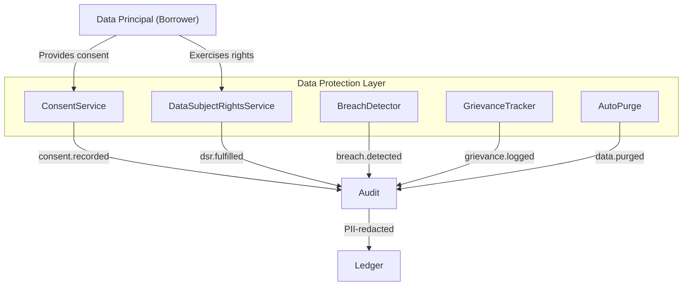

# Security

---

## Authentication

**HTTP API:** Bearer token authentication via `Authorization: Bearer <token>`
header.

Configured with `--require-auth` flag on `underwrite serve` or by setting
`UNDERWRITE_API_TOKEN`.  Token comparison uses `hmac.compare_digest()` to
prevent timing attacks (`__serve__.py:147`).

```python
if not hmac.compare_digest(received, token):
    return __error_response(401, "unauthorized")
```

When `require_auth=True` and no token is set, the server refuses to start
with a `ValueError`.

---

## Authorization

**Module:** `underwrite/__authz__.py`

`AccessControl` implements a policy engine with allow/deny rules and
**default-deny** semantics.

```python
acl = AccessControl()
acl.allow("audit", "*")        # audit service may subscribe to all events
acl.deny(  "foreign_svc", "*") # foreign_svc is blocked
```

### Policy Evaluation

1. Deny rules are checked first — first match rejects.
2. Allow rules are checked second — first match permits.
3. If no rule matches → **deny** (default).

### Policy File

Authorization rules can be loaded from a JSON file:

```json
{"allow": [{"subject": "mechanism", "resource": "*"}],
 "deny":  [{"subject": "untrusted", "resource": "saga.*"}]}
```

Set `authz.policy_file` in config or `UNDERWRITE_AUTHZ_POLICY_FILE`.

### Enforcement Points

- `NanoService.subscribe()` — checks `check_subscribe()` before
  registering the handler.
- `NanoService.emit()` — calls `assert_publish()` before publishing.
- `AccessControl.assert_verified()` — verifies event signature at
  dispatch time (`services/base.py:294-306`).

---

## Cryptographic Provenance

Every event emitted by a nano service is **Ed25519-signed** by the
service's `Identity`.

### Signing (`services/base.py:246-285`)

```python
to_sign = f"{event.event_id}:{event.timestamp}:{event.event_type}:{payload_str}"
signature = self.__identity.sign(to_sign)
```

The signature and public key (`source_key`) are attached to the `Event`
envelope.

### Verification (`__authz__.py:152-178`)

The receiving service reconstructs the signed payload and verifies:

```python
public_key.verify(signature, to_sign)
```

### Trust Model

- `AccessControl.trust(service_id, public_key)` registers a trusted key.
- `AccessControl.revoke_trust(service_id)` removes it.
- `verify_signature()` returns `False` if no trusted key is registered
  for the event source.
- When `cryptography` library is unavailable, all signatures are accepted
  (development mode — warns in logs).

---

## Key Management

**Module:** `underwrite/__identity__.py`

### Key Generation

`Identity.create()` generates Ed25519 keypairs.  Private keys can be:

- **Generated fresh** (default)
- **Loaded from PEM** string
- **Loaded from SecretsManager** (Vault, AWS SM, or env vars)

### Encryption at Rest

Private keys can be encrypted in memory using PKCS8
`BestAvailableEncryption` with a passphrase:

```python
Identity.create(service_id, encryption_passphrase="s3cr3t")
```

Without a passphrase, keys are stored as raw bytes (base64-encoded) in
memory.

### Key Rotation

`KeyRotationManager` handles automatic rotation:

| Parameter | Default | Description |
|---|---|---|
| `ttl_seconds` | `86400` (24h) | Key validity period before rotation |
| `grace_period` | `3600` (1h) | Old key retained for in-flight verification |

`verify_with_rotation()` checks both current and grace-period keys,
ensuring events signed just before rotation are still verifiable.

---

## Secrets Management

**Module:** `underwrite/__secrets__.py`

`SecretsManager` abstracts secret retrieval behind a `SecretsBackend`:

| Backend | Description |
|---|---|
| `EnvSecretsBackend` | Reads env vars `UNDERWRITE_SECRET_<NAME>` (read-only) |
| `VaultSecretsBackend` | HashiCorp Vault KV v2 (requires `hvac`) |
| `AwsSecretsBackend` | AWS Secrets Manager (requires `boto3`) |

Key path convention: `underwrite/{service_id}/private_key`.

---

## PII Redaction

**Module:** `underwrite/__pii.py`

### Field-Based Redaction

Keys matching known PII fields are redacted:
`aadhaar`, `pan`, `ssn`, `tax_id`, `passport`, `driving_license`,
`voter_id`, `phone`, `mobile`, `email`, `account_number`, `ifsc`,
`bank_account`.

### Value-Based Redaction

String values matching these regex patterns are redacted:
- 12-digit numbers (Aadhaar-like)
- PAN-like (`[A-Z]{5}[0-9]{4}[A-Z]`)
- SSN-like (`\d{3}-\d{2}-\d{4}` or 9 digits)
- Passport-like patterns

### Usage

- **AuditService** redacts every event payload via `PIISanitizer.sanitize()`
  before persisting to the ledger.
- **JSON log formatter** redacts sensitive fields in log output.

---

## Path Traversal Protection

**File:** `underwrite/__store__.py:341-360`

`FileStore.__path()` validates:

1. The key does not contain `..` or start with `/`.
2. The resolved absolute path is inside `data_dir`.
3. Symlinks are resolved and checked not to escape `data_dir`.

---

## SQL Injection Prevention

**File:** `underwrite/__store__.py:372-500`

`PostgresStore` uses **parameterized queries** for all values:

```python
cur.execute("SELECT value FROM store WHERE key = %s", (key,))
```

Table names are validated against a strict regex (`^[a-zA-Z_][a-zA-Z0-9_]*$`)
before interpolation — never user-supplied.

---

## Model Integrity

**File:** `underwrite/services/risk/model.py:180-196`

Risk model files are verified with SHA-256 before loading:

- Expected hash from `RISK_MODEL_SHA256` env var _or_ a
  `<model_path>.sha256` sidecar file.
- Mismatch raises `ValueError` and the model is not loaded.

Joblib deserialisation (arbitrary pickle) is gated behind
`UNDERWRITE_ALLOW_JOBLIB=true` — disabled by default.

---

## Rate Limiting

### HTTP Level (`__serve__.py`)

Token-bucket rate limiter applied to all endpoints.  Configurable via
`--rate-limit` (default 100 req/s).  Returns 429 when exhausted.

### Event Bus Level (`__bus__.py:284-328`)

`RateLimiter` implements a token-bucket per subscriber.  Configurable
via `bus.rate_limit` in config.  `DistributedRateLimiter` extends this
with store-backed counters for cross-process coordination.

### Idempotency Guard (`__bus__.py:376-423`)

`IdempotencyGuard` prevents duplicate event processing.  Bounded per
handler at `max_ids_per_handler=100000`.  Duplicates are silently dropped.

---

---

## DPDPA 2023 Compliance (India)

The platform is designed to support compliance with the Digital Personal Data Protection Act, 2023. Operationally, teams must configure and audit the following.

### Consent Management

The `ConsentService` manages consent lifecycle per DPDPA Chapter II requirements:

- **Purpose-specific consent**: Each data processing purpose (KYC, credit bureau, loan servicing, collection, communication) requires separate consent.
- **Validity period**: Configurable via `dpdpa.consent.consent_validity_days` (default 365 days). Expired consent triggers `consent.expired` events.
- **Withdrawal**: Borrowers may withdraw consent at any time via `consent.withdrawn` event.
- **Pre-check**: Compliance service performs consent pre-check before initiating KYC workflows.

### Data Subject Rights (DSR)

The `DataSubjectRightsService` handles DPDPA Chapter III data subject rights:

| Right | DSR Type | Implementation |
|---|---|---|
| Right to access | `access` | Returns all stored personal data for the data subject |
| Right to correction | `correction` | Updates inaccurate personal data |
| Right to erasure | `erasure` | Purges personal data (subject to legal retention) |
| Right to data portability | `portability` | Exports data in machine-readable format |
| Right to grievance redressal | `grievance` | Escalates unresolved complaints to DPO |

DSR fulfillment timeline: 30 days (configurable via `dpdpa.dsr.response_time_days`). Grievance resolution: 15 days (configurable via `dpdpa.dsr.grievance_response_days`).

### Data Retention

Configured via `dpdpa` config:
- **General data**: 8 years (`data_retention_years`) per IT Act record-keeping requirements
- **KYC data**: 5 years (`kyc_retention_years`) per PMLA rules
- **Auto-purge**: Optional (`enable_auto_purge`) — when enabled, expired data is automatically purged with `data.purged` event emission

### Breach Notification

Per DPDPA Section 8, the platform supports breach lifecycle:

1. **Detection**: `breach.detected` event emitted on potential breach identification
2. **Notification**: `breach.notified` emitted within 72 hours (configurable via `dpdpa.breach_notification_hours`) to the Data Protection Board and affected data subjects
3. **Closure**: `breach.closed` emitted after investigation and remediation

### Grievance Redressal

The platform tracks complaints via the grievance event flow:
- `grievance.logged` — complaint received from data subject
- `grievance.resolved` — complaint addressed within 15-day window

DPO contact information is configured via `dpdpa.dsr.dpo_email` and `dpdpa.dsr.dpo_phone`.

### Data Localization

All data is stored in-context:
- **Store backend**: Postgres or Filesystem — no cross-border data transfer
- **Audit ledger**: In-process event ledger with optional export
- **Logging**: Structured JSON logs with PII redaction before output
- **No external analytics**: No third-party analytics or tracking SDKs

For Indian cloud deployment, deploy store and application in the same Indian region (AWS `ap-south-1`, Azure Central India, or GCP `asia-south1`).

### PII Redation

**Module:** `underwrite/__pii.py`

In addition to the field-based and value-based redaction described above, the redactor handles Indian PII identifiers:

- **Aadhaar**: 12-digit numbers (masked to last 4 digits)
- **PAN**: `[A-Z]{5}[0-9]{4}[A-Z]` format (masked to last 4 characters)
- **Voter ID**: EPIC format
- **Passport**: International passport format
- **Bank account**: Account number + IFSC combination
- **Phone / Email**: Contact identifiers

Redaction is applied by **AuditService** before event persistence and by the **JSON log formatter** before output.

### Full-Page PII and Data Protection Diagram



---

## Security Checklist

- [ ] **Enable authorization**: Set `authz.enabled=true` in config.
- [ ] **Set an API token**: `UNDERWRITE_API_TOKEN` and `--require-auth`.
- [ ] **Use Postgres backend**: FileStore and MemoryStore provide no
      access controls.
- [ ] **Rotate signing keys**: Configure `KeyRotationManager` TTL.
- [ ] **Configure Vault/AWS SM**: Store private keys in a secrets
      backend, not env vars.
- [ ] **Enable PII redaction**: Verify `PIISanitizer` is applied (audit
      service does this by default).
- [ ] **Validate model hashes**: Set `RISK_MODEL_SHA256` for production
      risk models.
- [ ] **Restrict joblib**: Never set `UNDERWRITE_ALLOW_JOBLIB=true`
      unless you control the model file.
- [ ] **Configure consent management**: Set `dpdpa.consent.required_purposes` for all data processing purposes.
- [ ] **Set DPO contact**: Configure `dpdpa.dsr.dpo_email` for grievance redressal.
- [ ] **Configure data retention**: Set `dpdpa.data_retention_years` and `dpdpa.kyc_retention_years` per compliance requirements.
- [ ] **Enable breach detection**: Ensure `dpdpa.enable_breach_detection=true`.
- [ ] **Deploy in Indian region**: Store and compute in AWS `ap-south-1`, Azure Central India, or GCP `asia-south1`.
