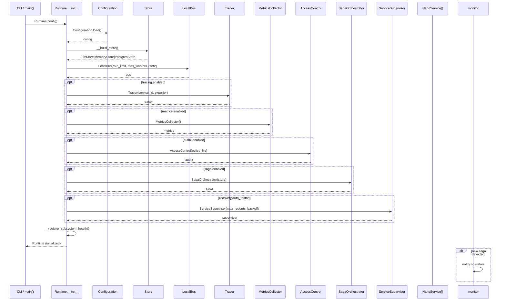
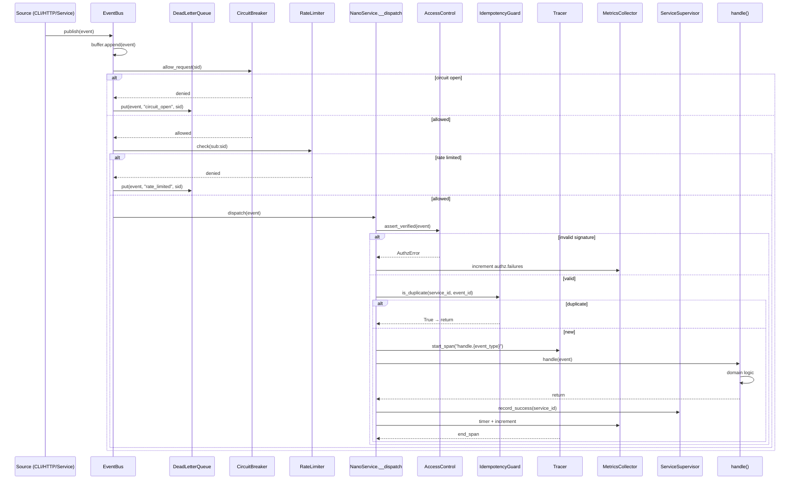
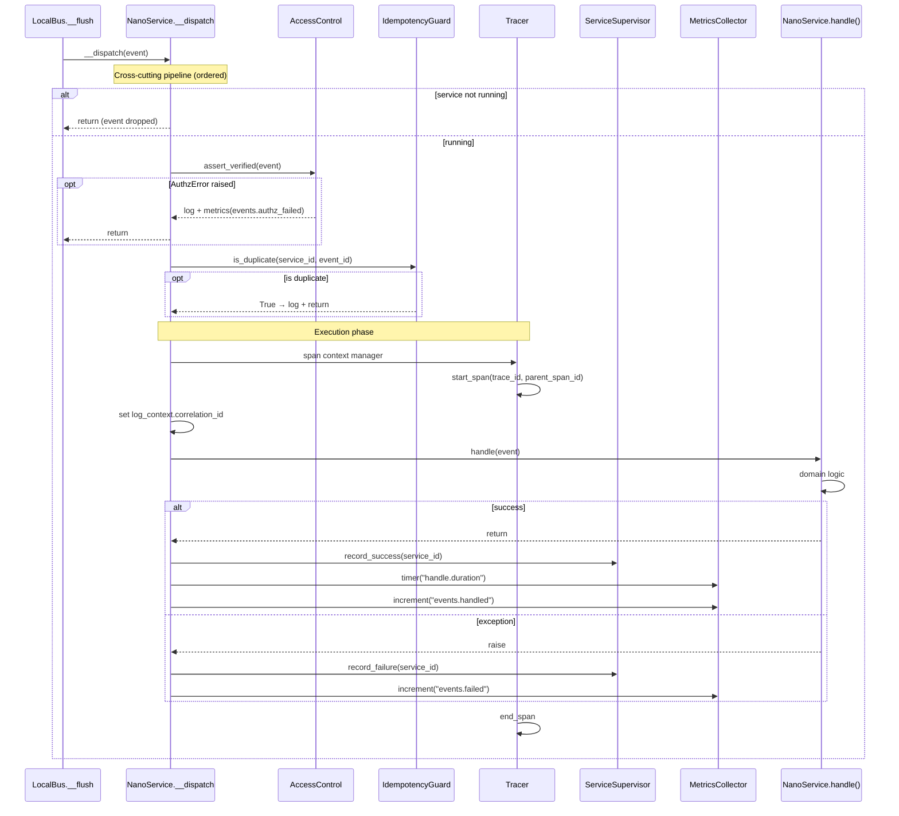
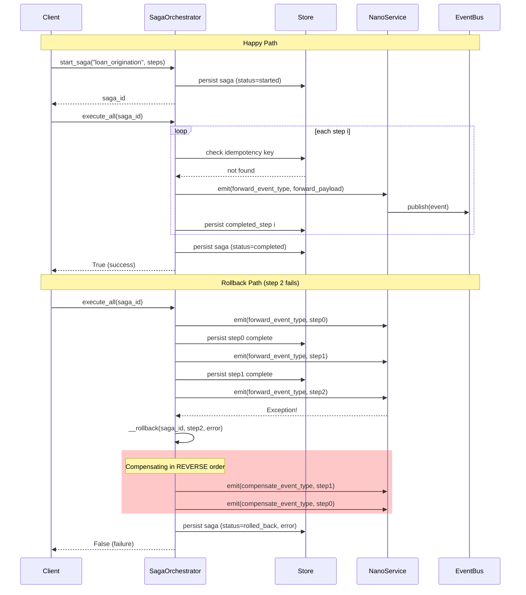
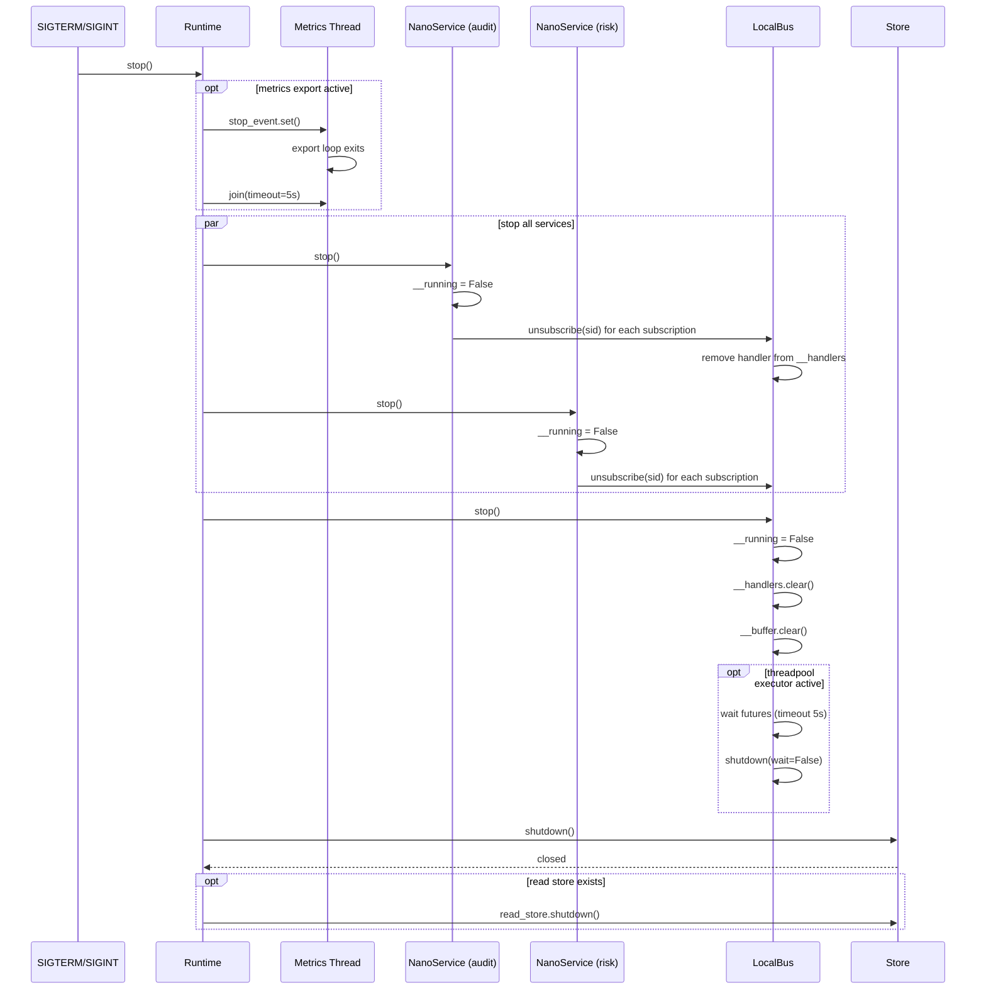
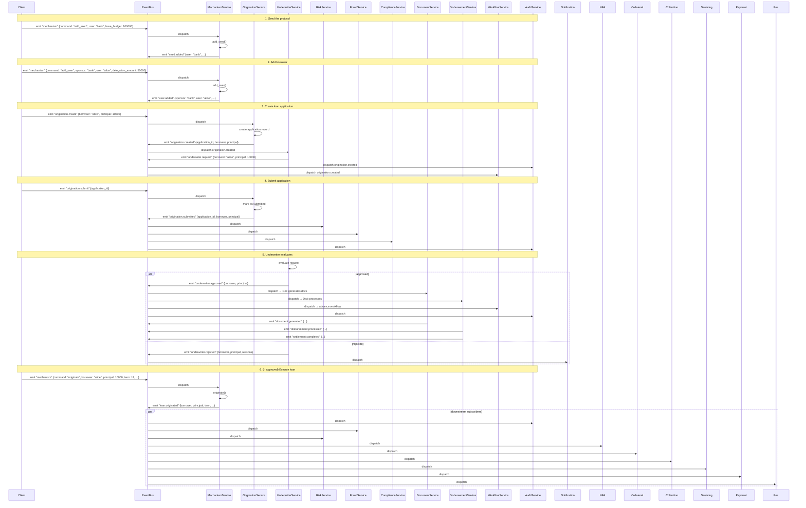

# System Design — Underwrite Platform

> Runtime behavior, request lifecycle, data flow, and internal interactions of the unsecured lending underwriting nano-service platform.

---

## 1. Runtime Initialization Flow

Source: `underwrite/__runtime__.py`

```python
Runtime(config)             # or Runtime() loads defaults
  │
  ├─1. Configuration loaded from JSON file or defaults
  │    (underwrite/__config__.py → Configuration)
  │
  ├─2. Store created
  │    ├─ config.store.backend == "filesystem" → FileStore(data_dir)
  │    ├─ config.store.backend == "memory"     → MemoryStore()
  │    └─ config.store.backend == "postgres"   → PostgresStore(dsn, pool_size)
  │
  ├─3. Optional read-store (CQRS)
  │    └─ config.store.read_backend set        → separate read Store
  │
  ├─4. EventBus created
  │    └─ LocalBus(rate_limit, max_workers, max_futures, store)
  │
  ├─5. Optional subsystems created based on config
  │    ├─ Tracer            (tracing.enabled)
  │    ├─ MetricsCollector  (metrics.enabled)
  │    ├─ SecretsManager    (secrets.backend != "none")
  │    ├─ SagaOrchestrator  (saga.enabled)
  │    ├─ AccessControl     (authz.enabled)
  │    └─ ServiceSupervisor (recovery.auto_restart)
  │
  ├─6. Subsystem health checks registered
  │
  └─ Runtime.start(service_names)
       ├─ a. Run migrations             (auto_migrate)
       ├─ b. Start metrics export loop  (export_interval > 0)
       ├─ c. For each service:
       │     ├─ register(name)          → importlib import + instantiate
       │     ├─ wire(name)              → subscribe to WIRING event types
       │     └─ start()                 → set __running = True
       └─ d. bus.start()                → flush buffered events
```

---

## 2. Event Lifecycle

Source: `underwrite/__events__.py`, `underwrite/__bus__.py`, `underwrite/services/base.py`

```
External Trigger (CLI / HTTP POST /v1/publish / internal emit)
  │
  ▼
Event created [event_id (UUID), timestamp, event_type, payload,
               source, source_key, correlation_id, signature, trace_id]
  │
  ▼
EventBus.publish(event)
  │
  ├─ Buffer appended
  ├─ If bus running: flush() → for each subscriber:
  │     ├─ CircuitBreaker.allow_request(sid)?
  │     │    └─ NO → DLQ.put(event, "circuit_open", sid)
  │     ├─ RateLimiter.check(sub:sid)?
  │     │    └─ NO → DLQ.put(event, "rate_limited", sid)
  │     └─ Dispatch (sync or threadpool):
  │           │
  │           ▼
  │     NanoService.__dispatch(event)
  │       ├─ not running? → return
  │       ├─ Authz: AccessControl.assert_verified(event)
  │       │    └─ FAIL → log + metrics, return
  │       ├─ Idempotency: is_duplicate(service_id, event_id)?
  │       │    └─ YES → log + return
  │       └─ __handle_event(event)
  │             ├─ Tracer: start span "handle.{event_type}"
  │             ├─ log_context.correlation_id = event.correlation_id
  │             ├─ handle(event)         ← domain logic (subclass)
  │             ├─ Supervisor: record_success(service_id)
  │             ├─ Metrics: timer + increment
  │             └─ On Exception:
  │                  ├─ events_failed += 1
  │                  ├─ Supervisor: record_failure(service_id)
  │                  └─ Metrics: increment events.failed
  │
  ▼
Service may emit downstream events inside handle()
  └─ Event signed with Ed25519 identity
  └─ Authz.assert_publish + trust registered
  └─ bus.publish(signed)
```

---

## 3. Event Type Catalog

Source: `underwrite/__events__.py` — 80+ event types in the `EventType` enum.

| Domain | Events |
|--------|--------|
| **Core** | `seed.added`, `user.added`, `loan.originated`, `repaid`, `default.occurred`, `revoked` |
| **Quote/Pricing** | `quote`, `quote.calculated`, `pricing.request`, `pricing.computed` |
| **KYC/AML** | `kyc.verified`, `kyc.rejected`, `aml.cleared`, `aml.frozen` |
| **Fraud** | `fraud.alert`, `fraud.wash.flag`, `fraud.velocity.flag` |
| **Risk** | `risk.scored`, `risk.early_warning` |
| **NPA** | `npa.bucket_changed`, `npa.dlg.triggered` |
| **Collateral** | `collateral.marked`, `collateral.liquidated` |
| **Governance** | `governance.proposal`, `governance.executed` |
| **Recovery** | `recovery.started`, `recovery.completed` |
| **Identity** | `identity.register`, `identity.registered`, `identity.rotate`, `identity.rotated` |
| **Notification** | `notification.sent` |
| **Reporting** | `report.generated` |
| **Underwriting** | `underwrite.request`, `underwriter.approved`, `underwriter.rejected` |
| **Document** | `document.generated` |
| **Disbursement** | `disbursement.processed` |
| **Collection** | `collection.updated` |
| **Settlement** | `settlement.completed` |
| **Origination** | `origination.create`, `origination.created`, `origination.submit`, `origination.submitted` |
| **Servicing** | `servicing.started` |
| **Payment** | `payment.receive`, `payment.received`, `payment.schedule`, `payment.due`, `payment.overdue`, `payment.check_overdue` |
| **Fee** | `fee.assess`, `fee.assessed`, `fee.pay` |
| **Statement** | `statement.generate`, `statement.generated` |
| **Communication** | `communication.send`, `communication.sent` |
| **Workflow** | `workflow.start`, `workflow.started`, `workflow.advance`, `workflow.completed` |
| **Decision** | `decision.evaluate`, `decision.made` |
| **Graph** | `graph_path`, `graph_credit_limit`, `graph_users`, `graph_path_result`, `graph_credit_limit_result`, `graph_users_result` |
| **Mechanism** | Command events (`add_seed`, `add_user`, `repay`, `originate`, `default`, `revoke`, `quote`), `mechanism.rejected` |
| **Saga** | `saga.started`, `saga.completed`, `saga.rolled_back`, `saga.compensate` |
| **Idempotency** | `idempotency.duplicate_dropped` |

---

## 4. Service Wiring

Source: `underwrite/__service_registry__.py`

The `WIRING` dict maps each event type to the list of services that subscribe to it:

| Event Type | Subscribers |
|---|---|
| `seed.added` | audit, origination |
| `user.added` | audit, fraud, compliance, risk, origination |
| `loan.originated` | audit, fraud, risk, npa, collateral, collection, servicing, payment, fee |
| `repaid` | audit, fraud, collection, payment, servicing |
| `default.occurred` | audit, npa, collateral, recovery, settlement, workflow |
| `revoked` | audit, graph |
| `quote.calculated` | audit, pricing |
| `kyc.verified` | audit, compliance, workflow |
| `kyc.rejected` | audit, compliance, notification, workflow |
| `aml.cleared` | audit, compliance |
| `aml.frozen` | audit, compliance, notification |
| `fraud.alert` / `wash.flag` / `velocity.flag` | audit, notification, decision |
| `risk.scored` | audit, underwriter, decision |
| `risk.early_warning` | audit, notification, servicing |
| `npa.bucket_changed` | audit, notification, collection |
| `dlg.triggered` | audit, notification, recovery |
| `collateral.marked` | audit |
| `collateral.liquidated` | audit, settlement |
| `underwriter.approved` | audit, document, disbursement, workflow |
| `underwriter.rejected` | audit, notification, workflow |
| `pricing.computed` | audit, quote, document |
| `document.generated` | audit, disbursement, communication |
| `disbursement.processed` | audit, servicing |
| `origination.created` | audit, underwriter, workflow |
| `origination.submitted` | audit, risk, fraud, compliance |
| `payment.received` | audit, collection, servicing, statement |
| `payment.due` | audit, notification, communication |
| `payment.overdue` | audit, collection, fee, notification |
| `settlement.completed` | audit, servicing, reporting |
| `decision.made` | audit, underwriter, workflow |
| `workflow.started` | audit |
| `workflow.completed` | audit, notification |
| `recovery.started` | audit, workflow |

Each service also subscribes to its own name as an event type for direct command routing (e.g., `mechanism` subscribes to `"mechanism"` for command events).

---

## 5. Graceful Shutdown

Source: `underwrite/__runtime__.py:559`, `underwrite/services/base.py:239`, `underwrite/__bus__.py:575`

```
Runtime.stop()
  │
  ├─1. Metrics export stop event set
  │     └─ metrics thread joined (timeout 5s)
  │
  ├─2. For each service:
  │     ├─ __running = False
  │     ├─ bus.unsubscribe(subscription_id) for all subscriptions
  │     └─ subscriptions list cleared
  │
  ├─3. bus.stop()
  │     ├─ __running = False
  │     ├─ handlers.clear()
  │     ├─ buffer.clear()
  │     ├─ thread pool: wait futures (timeout 5s), shutdown(wait=False)
  │     └─ futures cleared
  │
  └─4. Store shutdown
        ├─ primary store.shutdown()
        └─ read store.shutdown() (if separate)
```

---

## 6. Saga Orchestration Flow

Source: `underwrite/__saga__.py`

```
start_saga(name, steps) → saga_id
  │
  │  Saga created with:
  │    saga_id (UUID)
  │    steps: [{name, forward_event_type, forward_payload,
  │             compensate_event_type, compensate_payload}, ...]
  │    status: "started"
  │  Persisted to Store
  │
  ▼
execute_all(saga_id)
  │
  │  For i in range(len(steps)):
  │    ├─ execute_step(saga_id, i)
  │    │    ├─ Check idempotency: saga_step:{saga_id}:{i} exists? → skip
  │    │    ├─ Get emitter (NanoService) for saga name
  │    │    ├─ emitter.emit(step.forward_event_type, step.forward_payload)
  │    │    ├─ Record completed_step index
  │    │    ├─ Persist to Store
  │    │    └─ On failure → __rollback(saga_id, failed_step, error)
  │    │
  │    └─ If step fails → return False
  │
  ├─ Happy path: saga.status = "completed", persist
  │
  └─ Rollback path (__rollback):
       ├─ saga.status = "compensating"
       ├─ For each completed step in REVERSE order:
       │    └─ emitter.emit(step.compensate_event_type, step.compensate_payload)
       ├─ saga.status = "rolled_back"
       └─ Persist

Crash recovery: replay_saga(saga_id)
  ├─ Load saga from Store
  ├─ Find next unexecuted step after last completed step
  └─ execute remaining steps (idempotent via store keys)
```

---

## 7. Sequence Diagrams

### 7.1 Runtime Startup Sequence



### 7.2 Event Lifecycle



### 7.3 Service Dispatch Pipeline



### 7.4 Saga Orchestration (Happy Path + Rollback)



### 7.5 HTTP API Request Flow

```mermaid
sequenceDiagram
    participant Client
    participant FastAPI as FastAPI (__serve__.py)
    participant MW as Middlewares
    participant RT as Runtime
    participant Bus as EventBus
    participant Sub as Subscribers

    Client->>FastAPI: POST /v1/publish
    FastAPI->>MW: body_size_middleware
    Note over MW: Rejects >1MB bodies (413)
    MW->>MW: request_id_middleware
    Note over MW: Attaches X-Request-ID header
    MW->>MW: auth_rate_limit_middleware
    Note over MW: Bearer token check (401)<br/>Token-bucket rate limit (429)

    MW->>RT: async_publish(event_type, payload, correlation_id)
    RT->>RT: Event(event_type, source="runtime", payload)
    RT->>Bus: bus.publish(event)
    Bus->>Bus: buffer.append(event), flush()
    Bus-->>RT: event_id
    RT-->>MW: return
    MW-->>FastAPI: 202 Accepted
    FastAPI-->>Client: {"status": "accepted"}

    par dispatch to subscribers
        Bus->>Sub1: dispatch(event)
        Bus->>Sub2: dispatch(event)
        Bus->>SubN: dispatch(event)
    end

    Note over Client,FastAPI: Other endpoints
    Client->>FastAPI: GET /healthz (or /v1/health)
    FastAPI->>RT: runtime.health.status()
    RT-->>FastAPI: status dict
    FastAPI-->>Client: 200 OK / 503

    Client->>FastAPI: GET /v1/metrics
    FastAPI->>RT: metrics_as_text(runtime)
    RT-->>FastAPI: Prometheus text
    FastAPI-->>Client: text/plain; version=0.0.4
```

### 7.6 Graceful Shutdown Sequence



### 7.7 Loan Origination End-to-End Flow



---

## 8. Component Reference

| Component | File | Responsibility |
|---|---|---|
| `Runtime` | `__runtime__.py` | Lifecycle management, service registration, wiring, start/stop |
| `EventBus` / `LocalBus` | `__bus__.py` | In-process pub-sub with circuit breaker, rate limiter, DLQ |
| `NanoService` | `services/base.py` | Abstract base: signing, emit, subscribe, dispatch, tracing, idempotency |
| `StatefulService` | `services/base.py` | Base with state lock and store repository helpers |
| `Event` / `EventType` | `__events__.py` | Event envelope with UUID, timestamp, payload, Ed25519 signature |
| `AccessControl` | `__authz__.py` | Policy evaluation + Ed25519 signature verification |
| `Tracer` | `__tracer__.py` | Span lifecycle with Console/Otlp exporters |
| `MetricsCollector` | `__metrics__.py` | Counters, timers, gauges with tag dimensions |
| `SagaOrchestrator` | `__saga__.py` | Forward execution + compensating rollback, persisted to store |
| `ServiceSupervisor` | `__supervisor__.py` | Failure tracking and auto-restart with exponential backoff |
| `SecretsManager` | `__secrets__.py` | Secret rotation and retrieval |
| `IdempotencyGuard` | `__bus__.py` | Duplicate event detection by (handler_id, event_id) |
| `CircuitBreaker` | `__bus__.py` | Per-subscriber circuit breaker (CLOSED → OPEN → HALF_OPEN) |
| `DeadLetterQueue` | `__bus__.py` | Bounded failed-event storage with optional Store persistence |
| `RateLimiter` | `__bus__.py` | Token-bucket rate limiter per subscriber key |
| `Store` | `__store__.py` | Abstract persistence (MemoryStore / FileStore / PostgresStore) |
| `HealthRegistry` | `__health__.py` | Subsystem health check registration and status aggregation |
| `Configuration` | `__config__.py` | JSON-driven config with typed subsections |
| `create_app` | `__serve__.py` | FastAPI app factory with auth, rate-limit, middleware |
| CLI | `__cli__.py` | Typer CLI for `run`, `serve`, `health`, `dlq`, `metrics`, `migrate` |
| `PayloadValidator` | `validate.py` | Type-safe payload extraction with validation |
| `Identity` | `__identity__.py` | Ed25519 key pair generation and signing |
| `DelegationGraph` | `services/mechanism/graph.py` | Protocol state machine (seeds, users, loans, edges) |
