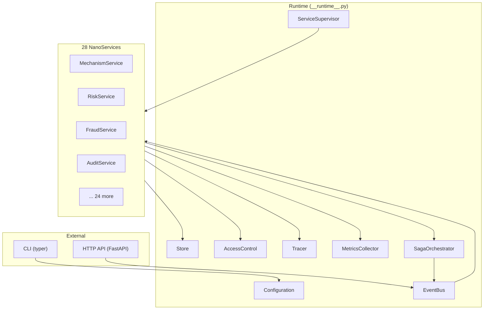
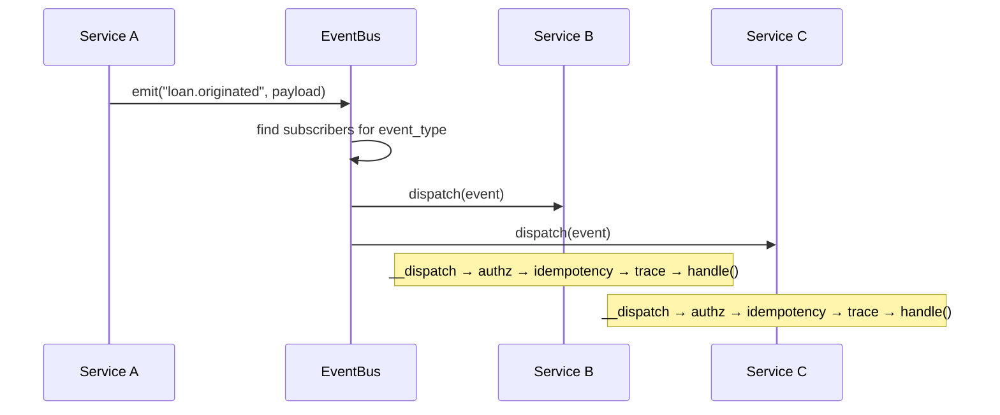
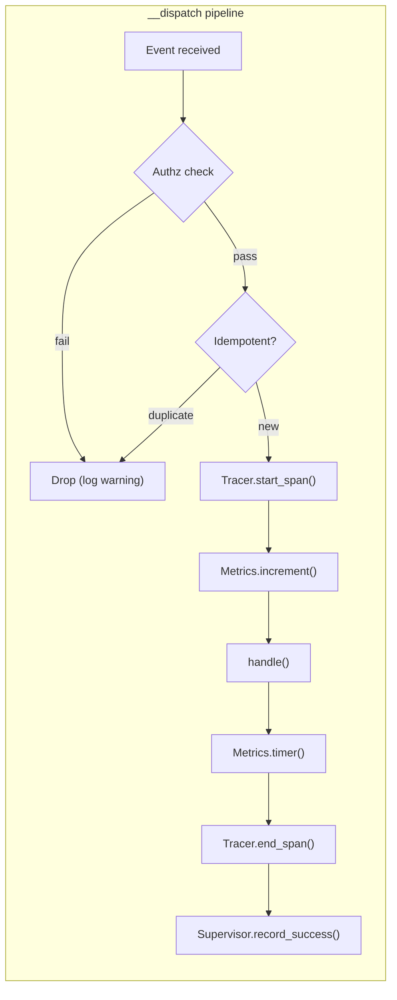
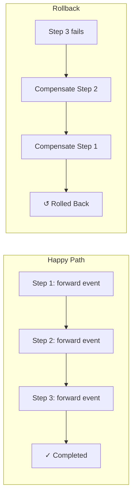
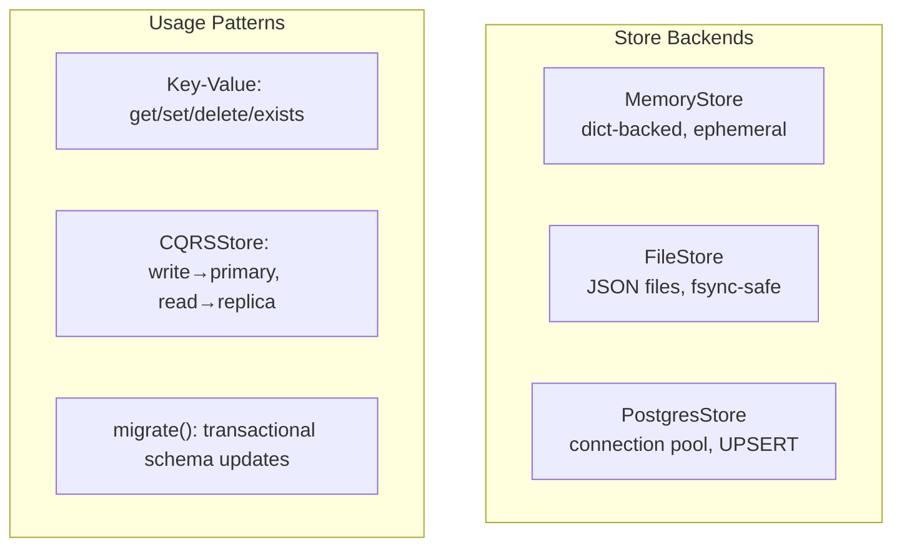

# Architecture — underwrite

## Overview

underwrite is an **event-driven nano-service platform** for delegated unsecured lending underwriting. 28 independent services communicate over a shared in-process event bus, each extending the `NanoService` abstract base class.



## Layers

| Layer | Module | Responsibility |
|-------|--------|---------------|
| **HTTP Gateway** | `__serve__.py` | FastAPI app, auth middleware, rate limiting, health/metrics endpoints |
| **CLI** | `__cli__.py` | Typer-based command interface (`run`, `list`, `health`, `dlq`, `metrics`) |
| **Runtime** | `__runtime__.py` | Service lifecycle, factory wiring, migration orchestration, health aggregation |
| **Event Bus** | `__bus__.py` | Publish/subscribe, dead-letter queue, rate limiter, idempotency guard |
| **State Store** | `__store__.py` | Key-value persistence (Memory/File/Postgres), CQRS wrapper |
| **Authz** | `__authz__.py` | Allow/deny policy evaluation, Ed25519 signature verification |
| **Identity** | `__identity__.py` | Ed25519 keypair creation, rotation, TTL management |
| **Saga** | `__saga__.py` | Multi-step transaction orchestration with compensating rollback |
| **Tracing** | `__tracer__.py` | Span creation, parent/child propagation, console/OTLP export |
| **Metrics** | `__metrics__.py` | Counters, timers, gauges, Prometheus-formatted export |
| **Circuit Breaker** | `__circuit__.py` | Failure isolation (CLOSED/OPEN/HALF_OPEN), exponential backoff retry |
| **Supervisor** | `__supervisor__.py` | Failure tracking, auto-restart with exponential backoff |
| **Secrets** | `__secrets__.py` | Secret retrieval (env vars, Vault, AWS Secrets Manager) |
| **Services** | `services/*/service.py` | Domain logic — 28 implementations |

## Event-Driven Communication

All nano-services communicate exclusively through typed domain events. Each event is an `Event` dataclass with:

- `event_id` — UUID v4
- `event_type` — string from the `EventType` enum (80+ values)
- `source` — emitting service ID
- `source_key` — Ed25519 public key
- `payload` — dict of domain data (max 1 MB, max 1000 keys)
- `signature` — Ed25519 signature over the canonical event content
- `correlation_id` — for tracing request chains
- `trace_id` / `parent_span_id` — distributed tracing context



## NanoService Base Class

Every service extends `NanoService` (or `StatefulService`) and implements:

```python
class MyService(NanoService):
    def handle(self, event: Event) -> None:
        # Domain logic — called by __dispatch
        ...
        self.emit("downstream.event", result_payload)
```

The base class handles all cross-cutting concerns automatically:



## Service Wiring

Service-to-event subscriptions are declared in the `WIRING` dictionary (`__service_registry__.py`). For example:

| Event Type | Subscribers |
|-----------|-------------|
| `loan.originated` | audit, fraud, risk, npa, collateral, collection, servicing, payment, fee |
| `default.occurred` | audit, npa, collateral, recovery, settlement, workflow |
| `underwriter.approved` | audit, document, disbursement, workflow |
| `fraud.alert` | audit, notification, decision |

## Saga Orchestration

Multi-step distributed transactions use the Saga pattern:



## State Persistence

The `Store` ABC abstracts persistence with three backends:



## Security Architecture

Every emitted event is Ed25519-signed by the source service's `Identity`:

1. `NanoService.emit()` creates the event, serializes the payload, signs with `self.__identity.sign(to_sign)`
2. Downstream `__dispatch()` calls `self.__authz.assert_verified(event)` to verify the signature
3. `AccessControl` evaluates allow/deny policies (default-deny) for publish and subscribe operations
4. Ed25519 keys are rotated manually by generating a new `Identity.create(...)` and updating the runtime; rely on `AccessControl.set_replay_window(...)` to keep recent signatures verifiable

## Resilience

| Pattern | Mechanism | Configuration |
|---------|-----------|---------------|
| Circuit breaker | Per-store, trips after N failures | 3 failures, 15s recovery |
| Retry | Exponential backoff with jitter | 2 retries, 50ms base delay |
| Rate limiting | Token bucket per subscriber | 100 ops/s default |
| Dead letter queue | Bounded FIFO, optional Store persistence | 1000 max entries |
| Idempotency | (handler_id, event_id) dedup | Bounded per handler |
| Service supervisor | Auto-restart with backoff | 3 max restarts, 1s base backoff |

## Observability

| Concern | Mechanism | Export |
|---------|-----------|--------|
| Logging | stdlib logging, JSON formatter, PII redaction | stdout/stderr |
| Metrics | Counters, timers, gauges | /v1/metrics (Prometheus) |
| Tracing | Span lifecycle with parent/child | Console or OTLP/gRPC |
| Health | Named check registry | /healthz, /readyz, /v1/health |
