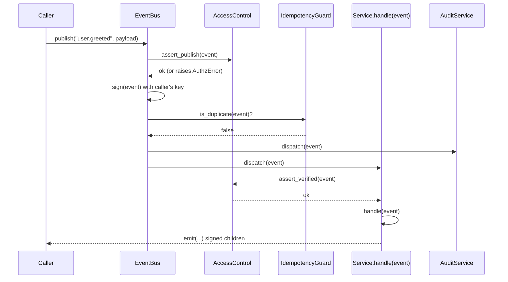

# Tutorial: the event bus

This tutorial walks through what happens between the moment you call
`runtime.publish(...)` and the moment the receiving service's
`handle(event)` runs. By the end you will understand every cross-
cutting concern the runtime wires for you — authz, idempotency,
tracing, metrics, DLQ, and the circuit breaker.

## The lifecycle of an event



The runtime takes care of every step in the diagram. You write the
service's `handle(event)` and the runtime inserts the rest.

## Publishing

The simplest way to publish an event is `runtime.publish`:

```python
runtime.publish("user.greeted", {"name": "priya"})
```

`runtime.publish` constructs a `Message`, signs it with the
**runtime's** Ed25519 identity, and dispatches it through the bus.
Use this for ad-hoc events from driver scripts.

For services, prefer `self.emit(...)`. The base class signs the
event with the **service's** key — so downstream verifiers see the
real source identity:

```python
class Greeter(Core):
    def handle(self, event: Message) -> None:
        self.emit("user.greeted_back", {"name": event.payload["name"]})
```

## Subscribing

There are two ways to subscribe:

| Pattern | Code | When to use |
|---------|------|-------------|
| Declarative | `self.subscribe("user.greeted")` in `__init__` | Static subscriptions known at construction time. |
| Dynamic | `bus.subscribe("user.greeted", handler)` | Conditional subscriptions, multi-tenant routing, plugins. |

`self.subscribe` is the convention for the 34 wired services. The
base class turns the subscription into a handler registration with
the bus, with `authz.assert_subscribe` called automatically.

## Authz, signing, and verification

Every event carries an Ed25519 signature over the canonical signing
bytes (`event_id | timestamp | event_type | source | payload`). The
runtime verifies the signature before dispatching to your handler:

```python
class AccessControl:
    def verify_signature(self, event: Message) -> bool: ...
```

A `False` result means the event is dropped (with a `WARNING` log line)
and **never reaches your handler**. If authz is enabled but you have
not `trust()`-ed the source key, every event from that source is
rejected.

Trust a key like this:

```python
runtime.authz.trust("greeter", greeter.identity.public_key)
```

The runtime trusts its own key automatically at startup; individual
service identities are trusted when their `Core` is constructed.

## Idempotency

The bus keeps a `(handler_id, event_id)` cache. Duplicate events —
the same `event_id` arriving twice — are dropped silently after the
first delivery. This makes the bus **at-least-once with idempotent
re-processing**, which is the safe default for nano-services that
emit at-least-once from upstream sources.

You can read the cache state with `bus.idempotency.size()`.

## Tracing

The runtime creates a span around every `dispatch` and propagates
`trace_id` and `parent_span_id` to outgoing events. The default
tracer prints spans to the console; pass `tracing.exporter = "otlp"`
in the configuration to forward them to an OTLP collector:

```yaml
tracing:
  enabled: true
  exporter: otlp
  endpoint: http://localhost:4317
```

Spans are visible via the runtime:

```python
runtime.tracer.spans[-1]   # the most recent span
```

## Metrics

Every dispatch increments `underwrite.events.dispatched` and increments
per-service counters when the handler runs. The runtime also tracks
`underwrite.events.failed`, `underwrite.events.dlq`, and per-handler
latency via `underwrite.handler.latency_ms`.

You can read the snapshot at any point:

```python
runtime.metrics.snapshot()
```

The HTTP `/v1/metrics` endpoint exposes the same snapshot in
Prometheus exposition format.

## DLQ — what happens when a handler raises

If your handler raises an exception, the bus does three things:

1. Logs the failure at `ERROR` with the exception traceback.
2. Records the event + error in the DLQ.
3. Increments the circuit breaker for that subscriber.

The next event still goes through your handler — the circuit breaker
trips only after the configured threshold of consecutive failures
(defaults to 3) within the recovery window.

Inspect the DLQ:

```python
runtime.bus.dlq.count()        # number of recorded failures
runtime.bus.dlq.clear()        # drop everything
runtime.bus.dlq.replay(bus)    # re-publish (use sparingly)
```

You can also use the CLI:

```bash
underwrite dlq            # show the DLQ contents
underwrite dlq --replay   # re-publish everything
```

## Circuit breaker

Every subscriber has a circuit breaker. After three consecutive
failures (configurable), the breaker opens for 15 seconds (also
configurable). While open, the bus skips the subscriber entirely
and routes the event straight to the DLQ with a `breaker_open` note.
After the recovery window, the breaker enters `HALF_OPEN`: the next
event is allowed through, and a successful handle closes the circuit.

The breaker is **transparent**: you do not see it from your handler.
You only see the symptoms (DLQ growing, no `handle` calls).

## Putting it together — a worked example

```python
"""Drive a multi-step flow and observe every cross-cutting concern."""

import logging
from underwrite.runtime import Runtime

logging.basicConfig(level=logging.INFO)


def main() -> None:
    with Runtime() as runtime:
        runtime.start(["mechanism", "audit", "pricing"])

        # Publish an event.
        event_id = runtime.publish(
            "mechanism",
            {"command": "add_seed", "user": "hdfc", "base_budget": 1_000_000},
        )
        print(f"published {event_id}")

        # Inspect the bus state.
        print(f"events dispatched: {runtime.metrics.snapshot()['counters'].get('underwrite.events.dispatched', 0)}")
        print(f"dlq size: {runtime.bus.dlq.count()}")

        # Inspect health.
        print(runtime.health.status())


if __name__ == "__main__":
    main()
```

## Where to go next

- [Build your first service](TUTORIAL_FIRST_SERVICE.md) — write a
  service in under fifty lines.
- [Custom nano-services](TUTORIAL_CUSTOM_NANO.md) — the patterns used
  by the 34 wired services, distilled.
- [Architecture](architecture.md) — diagrams and design decisions.
- [Observability](OBSERVABILITY.md) — full metrics + tracing reference.