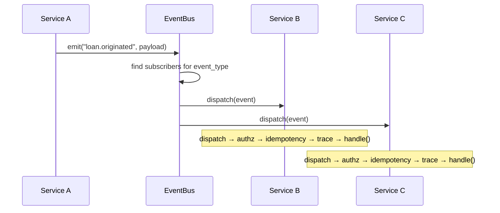
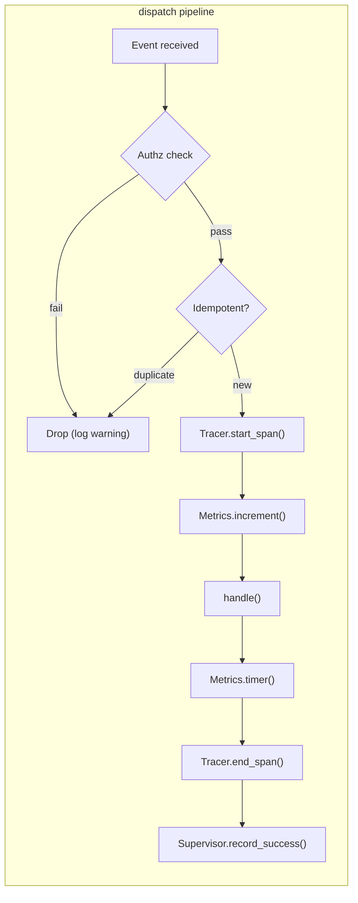
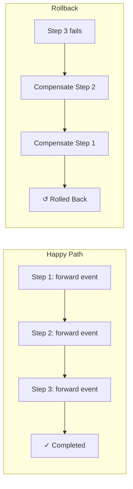
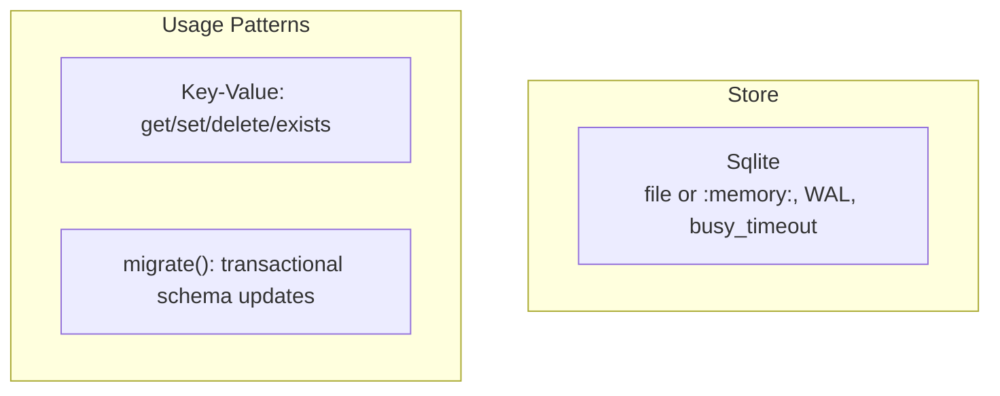

# Architecture

## Overview

Underwrite is an **event-driven nano-service platform** for delegated unsecured lending underwriting. 34 independent services communicate over a shared in-process event bus, each extending the `Core` abstract base class.

## The layered design

<div class="uw-architecture" markdown>
<svg viewBox="0 0 920 460" xmlns="http://www.w3.org/2000/svg" role="img" aria-label="Underwrite architecture — application domain over typed events over Underwrite core over infrastructure">
<defs>
<marker id="uw-arch-arrow" viewBox="0 0 10 10" refX="9" refY="5" markerWidth="7" markerHeight="7" orient="auto">
<path d="M 0 0 L 10 5 L 0 10 z" fill="#6B7280" />
</marker>
<style>
.arch-layer { font-family: "JetBrains Mono", "IBM Plex Mono", monospace; font-size: 10px; font-weight: 600; letter-spacing: 0.18em; fill: #6B7280; }
.arch-domain { fill: #FAF8F5; stroke: #D1D5DB; stroke-width: 1; }
.arch-domain-text { font-family: "Inter", sans-serif; font-size: 12px; font-weight: 600; fill: #0A0E14; }
.arch-domain-sub { font-family: "JetBrains Mono", monospace; font-size: 9px; fill: #6B7280; }
.arch-event { stroke: #6B7280; stroke-width: 1.5; fill: none; marker-end: url(#uw-arch-arrow); }
.arch-event-label { font-family: "JetBrains Mono", monospace; font-size: 10px; fill: #1B49C7; letter-spacing: 0.04em; font-weight: 500; }
.arch-core { fill: #0A0E14; }
.arch-core-text { font-family: "Inter", sans-serif; font-size: 12px; font-weight: 600; fill: #FAF8F5; }
.arch-core-sub { font-family: "JetBrains Mono", monospace; font-size: 9px; fill: rgba(250,248,245,0.6); }
.arch-core-accent { fill: #5C85FF; }
.arch-infra { fill: #DCE6FF; stroke: #2F6BFF; stroke-width: 1; }
.arch-infra-text { font-family: "Inter", sans-serif; font-size: 12px; font-weight: 600; fill: #1B49C7; }
</style>
</defs>

<text x="40" y="32" class="arch-layer">APPLICATION DOMAIN</text>
<g>
<rect class="arch-domain" x="40"  y="48" width="120" height="56" rx="6" />
<text class="arch-domain-text" x="100" y="74" text-anchor="middle">KYC</text>
<text class="arch-domain-sub"  x="100" y="90" text-anchor="middle">services/compliance</text>

<rect class="arch-domain" x="180" y="48" width="120" height="56" rx="6" />
<text class="arch-domain-text" x="240" y="74" text-anchor="middle">AML</text>
<text class="arch-domain-sub"  x="240" y="90" text-anchor="middle">services/compliance</text>

<rect class="arch-domain" x="320" y="48" width="120" height="56" rx="6" />
<text class="arch-domain-text" x="380" y="74" text-anchor="middle">Credit</text>
<text class="arch-domain-sub"  x="380" y="90" text-anchor="middle">services/credit_bureau</text>

<rect class="arch-domain" x="460" y="48" width="120" height="56" rx="6" />
<text class="arch-domain-text" x="520" y="74" text-anchor="middle">Pricing</text>
<text class="arch-domain-sub"  x="520" y="90" text-anchor="middle">services/pricing</text>

<rect class="arch-domain" x="600" y="48" width="120" height="56" rx="6" />
<text class="arch-domain-text" x="660" y="74" text-anchor="middle">KFS</text>
<text class="arch-domain-sub"  x="660" y="90" text-anchor="middle">services/kfs</text>

<rect class="arch-domain" x="740" y="48" width="140" height="56" rx="6" />
<text class="arch-domain-text" x="810" y="74" text-anchor="middle">Origination</text>
<text class="arch-domain-sub"  x="810" y="90" text-anchor="middle">services/mechanism</text>
</g>

<text x="40" y="148" class="arch-layer">TYPED EVENTS · Ed25519 signed</text>
<line x1="100" y1="104" x2="100" y2="172" class="arch-event" />
<line x1="240" y1="104" x2="240" y2="172" class="arch-event" />
<line x1="380" y1="104" x2="380" y2="172" class="arch-event" />
<line x1="520" y1="104" x2="520" y2="172" class="arch-event" />
<line x1="660" y1="104" x2="660" y2="172" class="arch-event" />
<line x1="810" y1="104" x2="810" y2="172" class="arch-event" />
<text x="460" y="166" class="arch-event-label" text-anchor="middle">kyc.verified · aml.cleared · credit_bureau.checked · pricing.computed · kfs.generated · loan.originated</text>

<text x="40" y="200" class="arch-layer">UNDERWRITE CORE</text>
<rect class="arch-core" x="40" y="216" width="840" height="108" rx="10" />
<g>
<rect x="56"  y="232" width="120" height="76" rx="6" fill="rgba(255,255,255,0.04)" stroke="rgba(255,255,255,0.08)" />
<text class="arch-core-text" x="116" y="256" text-anchor="middle">Authz</text>
<text class="arch-core-sub"  x="116" y="276" text-anchor="middle">policy engine</text>
<text class="arch-core-sub"  x="116" y="290" text-anchor="middle">default-deny</text>

<rect x="184" y="232" width="120" height="76" rx="6" fill="rgba(255,255,255,0.04)" stroke="rgba(255,255,255,0.08)" />
<text class="arch-core-text" x="244" y="256" text-anchor="middle">Identity</text>
<text class="arch-core-sub"  x="244" y="276" text-anchor="middle">Ed25519</text>
<text class="arch-core-sub"  x="244" y="290" text-anchor="middle">key rotation</text>

<rect x="312" y="232" width="120" height="76" rx="6" fill="rgba(255,255,255,0.04)" stroke="rgba(255,255,255,0.08)" />
<text class="arch-core-text" x="372" y="256" text-anchor="middle">Idempotency</text>
<text class="arch-core-sub"  x="372" y="276" text-anchor="middle">bounded cache</text>
<text class="arch-core-sub"  x="372" y="290" text-anchor="middle">at-least-once</text>

<rect x="440" y="232" width="120" height="76" rx="6" fill="rgba(255,255,255,0.04)" stroke="rgba(255,255,255,0.08)" />
<text class="arch-core-text" x="500" y="256" text-anchor="middle">Supervisor</text>
<text class="arch-core-sub"  x="500" y="276" text-anchor="middle">auto-restart</text>
<text class="arch-core-sub"  x="500" y="290" text-anchor="middle">backoff</text>

<rect x="568" y="232" width="120" height="76" rx="6" fill="rgba(255,255,255,0.04)" stroke="rgba(255,255,255,0.08)" />
<text class="arch-core-text" x="628" y="256" text-anchor="middle">Sagas</text>
<text class="arch-core-sub"  x="628" y="276" text-anchor="middle">compensating</text>
<text class="arch-core-sub"  x="628" y="290" text-anchor="middle">rollback</text>

<rect x="696" y="232" width="120" height="76" rx="6" fill="rgba(255,255,255,0.04)" stroke="rgba(255,255,255,0.08)" />
<text class="arch-core-text" x="756" y="256" text-anchor="middle">DLQ</text>
<text class="arch-core-sub"  x="756" y="276" text-anchor="middle">bounded</text>
<text class="arch-core-sub"  x="756" y="290" text-anchor="middle">replayable</text>

<rect x="824" y="232" width="40" height="76" rx="6" fill="rgba(255,255,255,0.04)" stroke="rgba(255,255,255,0.08)" />
<text class="arch-core-accent" x="844" y="270" text-anchor="middle" font-size="14" font-weight="600">+</text>
</g>

<text x="40" y="356" class="arch-layer">INFRASTRUCTURE</text>
<g>
<rect class="arch-infra" x="40"  y="372" width="200" height="36" rx="6" />
<text class="arch-infra-text" x="140" y="395" text-anchor="middle">Store · SQLite (file / :memory:)</text>

<rect class="arch-infra" x="260" y="372" width="200" height="36" rx="6" />
<text class="arch-infra-text" x="360" y="395" text-anchor="middle">Metrics · Prometheus</text>

<rect class="arch-infra" x="480" y="372" width="200" height="36" rx="6" />
<text class="arch-infra-text" x="580" y="395" text-anchor="middle">Tracing · OpenTelemetry</text>

<rect class="arch-infra" x="700" y="372" width="180" height="36" rx="6" />
<text class="arch-infra-text" x="790" y="395" text-anchor="middle">Secrets · Vault / AWS</text>
</g>

<line x1="100" y1="324" x2="140" y2="372" class="arch-event" />
<line x1="240" y1="324" x2="360" y2="372" class="arch-event" />
<line x1="380" y1="324" x2="580" y2="372" class="arch-event" />
<line x1="520" y1="324" x2="790" y2="372" class="arch-event" />
</svg>
</div>

## Where cross-cutting concerns attach

The Underwrite core sits between the application domain and the
infrastructure. Every cross-cutting concern is wired into the
`Core.dispatch` pipeline:

| Concern | Where it attaches | What it adds |
|---------|-------------------|--------------|
| Signing | `Core.emit` | Ed25519 over canonical bytes |
| Verification | `Core.dispatch` | Signature checked before handler runs |
| Idempotency | `Core.dispatch` | Duplicates dropped silently |
| Tracing | `Core.handle_event` | Span lifecycle, parent / child propagation |
| Metrics | `Core.handle_event` | Counters, timers, gauges per service |
| Authz | `Core.dispatch` + `Core.emit` | Default-deny policy evaluation |
| DLQ | `LocalBus.dispatch` | Failed events captured with error |
| Circuit breaker | `LocalBus.dispatch` | Per-subscriber breaker |
| Saga coordination | `Orchestrator` | Multi-step workflows with rollback |

These are not optional. Every `Core`-derived service inherits
them through the dispatch pipeline; there is no way for a service
to opt out, and no way for a service to write the dispatch logic
itself.

## Layers

| Layer | Module | Responsibility |
|-------|--------|----------------|
| **HTTP Gateway** | `serve.py` | FastAPI app, auth middleware, rate limiting, health/metrics endpoints |
| **CLI** | `cli.py` | Typer-based command interface (`run`, `list`, `health`, `dlq`, `metrics`) |

## Layers

| Layer | Module | Responsibility |
|-------|--------|---------------|
| **HTTP Gateway** | `serve.py` | FastAPI app, auth middleware, rate limiting, health/metrics endpoints |
| **CLI** | `cli.py` | Typer-based command interface (`run`, `list`, `health`, `dlq`, `metrics`) |
| **Runtime** | `runtime.py` | Service lifecycle, factory wiring, migration orchestration, health aggregation |
| **Event Bus** | `bus.py` | Publish/subscribe, dead-letter queue, rate limiter, idempotency guard |
| **State Store** | `store.py` | SQLite persistence (file or `:memory:`) |
| **Authz** | `authz.py` | Allow/deny policy evaluation, Ed25519 signature verification |
| **Identity** | `identity.py` | Ed25519 keypair creation, rotation, TTL management |
| **Saga** | `saga.py` | Multi-step transaction orchestration with compensating rollback |
| **Tracing** | `tracer.py` | Span creation, parent/child propagation, console/OTLP export |
| **Metrics** | `metrics.py` | Counters, timers, gauges, Prometheus-formatted export |
| **Circuit Breaker** | `circuit.py` | Failure isolation (CLOSED/OPEN/HALF_OPEN), exponential backoff retry |
| **Supervisor** | `supervisor.py` | Failure tracking, auto-restart with exponential backoff |
| **Secrets** | `secrets.py` | Secret retrieval (env vars, Vault, AWS Secrets Manager) |
| **Services** | `services/*/service.py` | Domain logic — 34 implementations |

## Event-Driven Communication

All nano-services communicate exclusively through typed domain events. Each event is a `Message` dataclass with:

- `event_id` — UUID v4
- `event_type` — string from the `Type` enum (132 values)
- `source` — emitting service ID
- `source_key` — Ed25519 public key
- `payload` — dict of domain data (max 1 MB, max 1000 keys)
- `signature` — Ed25519 signature over the canonical event content
- `correlation_id` — for tracing request chains
- `trace_id` / `parent_span_id` — distributed tracing context



## Core Base Class

Every service extends `Core` (or `StatefulService`) and implements:

```python
class MyService(Core):
    def handle(self, event: Message) -> None:
        # Domain logic — called by dispatch
        ...
        self.emit("downstream.event", result_payload)
```

The base class handles all cross-cutting concerns automatically:



## Service Wiring

Service-to-event subscriptions are declared in the `WIRING` dictionary (`handler.py`). For example:

| Event Type | Subscribers |
|-----------|-------------|
| `loan.originated` | audit, fraud, risk, npa, collateral, collection, servicing, payment, fee |
| `default.occurred` | audit, npa, collateral, recovery, settlement, workflow |
| `underwriter.approved` | audit, document, disbursement, workflow |
| `fraud.alert` | audit, notification, decision |

## Saga Orchestration

Multi-step distributed transactions use the Saga pattern:



## State Persistence

The platform persists state through a single `Sqlite` backend
backed by the Python standard library `sqlite3`. A `:memory:`
path gives an ephemeral in-process database; any other path
creates a file-backed database with WAL journaling.



## Security Architecture

Every emitted event is Ed25519-signed by the source service's `Identity`:

1. `Core.emit()` creates the event, serializes the payload, signs with `self.__identity.sign(to_sign)`
2. Downstream `dispatch()` calls `self.authz.assert_verified(event)` to verify the signature
3. `AccessControl` evaluates allow/deny policies (default-deny) for publish and subscribe operations
4. Ed25519 keys are rotated manually by generating a new `Identity.create(...)` and updating the runtime; rely on `AccessControl.set_replay_window(...)` to keep recent signatures verifiable

## Resilience

| Pattern | Mechanism | Configuration |
|---------|-----------|---------------|
| Circuit breaker | Per-store, trips after N failures | 3 failures, 15s recovery |
| Retry | Exponential backoff with jitter | 2 retries, 50ms base delay |
| Rate limiting | Token bucket per subscriber | 100 ops/s default |
| Dead letter queue | Bounded FIFO, optional Store persistence | 1000 max entries |
| Idempotency | (handler_id, event_id) dedup | Bounded per handler |
| Service supervisor | Auto-restart with backoff | 3 max restarts, 1s base backoff |

## Observability

| Concern | Mechanism | Export |
|---------|-----------|--------|
| Logging | loguru with PII-redacting sink, JSON formatter, level + output configurable | stdout/stderr |
| Metrics | Counters, timers, gauges | /v1/metrics (Prometheus) |
| Tracing | Span lifecycle with parent/child | Console or OTLP/gRPC |
| Health | Named check registry | /healthz, /readyz, /v1/health |
