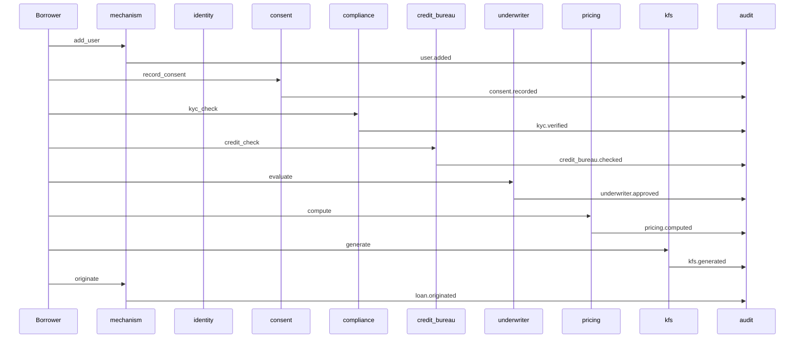

# Indian lending lifecycle

The full Underwrite underwriting journey, end-to-end, against an
in-memory runtime. Twelve stages from onboarding to origination —
each one a nano-service, each transition a typed event, each event
carrying the runtime guarantees into the next stage.

This page is the primary mental model for the platform. The same
flow runs in production against Sqlite + OTLP + Vault; here it runs
in a single Python process with no broker, no cluster, no external
dependencies.

## The flow

01
<h3 class="uw-stage__name">Onboarding</h3>
The mechanism service seeds capital and creates a sponsor → borrower pair. The first durable identity.
seed.added · user.added

02
<h3 class="uw-stage__name">Identity</h3>
PAN and Aadhaar identifiers attach to the borrower. The identity service emits an attestable identity-registered event.
identity.registered

03
<h3 class="uw-stage__name">Consent</h3>
DPDPA consent is recorded with a specific purpose (KYC verification). Withdrawable at any time. The consent service enforces re-consent on purpose change.
consent.recorded

04
<h3 class="uw-stage__name">KYC</h3>
PAN format validation, Aadhaar Verhoeff checksum, AML risk score, CKYC registry trigger. Wire-protocol clients against NSDL / UIDAI / Karza.
kyc.verified

05
<h3 class="uw-stage__name">AML</h3>
Sanctions screening, transaction pattern checks, risk scoring. AML clears or freezes; the runtime routes to the next stage or to the DLQ with a recorded error.
aml.cleared · aml.flagged

06
<h3 class="uw-stage__name">Credit bureau</h3>
CIBIL / Experian / Equifax pull. The credit_bureau service emits a normalized credit_bureau.checked event regardless of which bureau responded.
credit_bureau.checked

07
<h3 class="uw-stage__name">Underwriting</h3>
Rule engine + ML risk model evaluate the application against business rules. Approved, rejected, conditional, or escalated.
underwriter.approved · underwriter.rejected

08
<h3 class="uw-stage__name">Pricing</h3>
RBI rate caps applied. All-in-cost APR (interest + fees + GST + insurance) computed. EMI, total interest, processing fee emitted.
pricing.computed

09
<h3 class="uw-stage__name">Compliance</h3>
Cooling-off period enforced. Breach checks run. Compliance emits kfs.generated and gates the next stage.
kfs.generated

10
<h3 class="uw-stage__name">KFS</h3>
Key Fact Statement issued to the borrower — a complete, versioned disclosure of every pricing and consent fact.
kfs.generated

11
<h3 class="uw-stage__name">Mandate</h3>
e-NACH / UPI Autopay mandate collection. <em>Roadmap item — not yet wired to a partner.</em> When enabled, the razorpay service emits mandate events.
razorpay.mandate.active (planned)

12
<h3 class="uw-stage__name">Origination</h3>
The mechanism service books the loan. The audit service persists a redacted copy. The NPA classifier starts watching. The lifecycle is complete.
loan.originated

## What the runtime adds at every transition

| Concern | Where it attaches | What it adds |
|---------|-------------------|--------------|
| Signing | `Core.emit` | Ed25519 over canonical bytes; deterministic across processes |
| Verification | `Core.dispatch` | Signature checked before handler runs |
| Idempotency | `Core.dispatch` | Duplicates dropped silently; cache bounded |
| Tracing | `Core.handle_event` | Span lifecycle, parent / child propagation |
| Metrics | `Core.handle_event` | Counters, timers, gauges per service and event type |
| Authz | `Core.dispatch` + `Core.emit` | Default-deny policy evaluation |
| DLQ | `LocalBus.dispatch` | Failed events captured with original error |
| Circuit breaking | `LocalBus.dispatch` | Per-subscriber breaker; OPEN after threshold |
| Saga coordination | `Orchestrator` | Multi-step workflows with compensating rollback |

These guarantees are not optional. Every `Core`-derived service
inherits them through the `dispatch` pipeline; there is no way for
a service to opt out, and no way for a service to write the
dispatch logic itself.

## Compliance responsibility by stage

| Stage | Responsibility |
|-------|----------------|
| Onboarding | KYC for the sponsor; sponsor authorization |
| Identity | Identity verification; re-attestation on key rotation |
| Consent | DPDPA consent validity; purpose binding; withdrawal |
| KYC | PAN format, Aadhaar Verhoeff, AML risk score |
| AML | Sanctions screening; PEP screening; transaction patterns |
| Credit bureau | Bureau response normalization; consent re-check |
| Underwriting | Business rules; model versioning; explainability |
| Pricing | RBI rate caps; all-in-cost APR disclosure |
| Compliance | Cooling-off; KFS issuance before disbursement |
| KFS | Complete disclosure; version pinning |
| Mandate | e-NACH / UPI Autopay consent; revocation handling |
| Origination | Audit ledger; NPA classifier activation |

## Visualizing the flow

Every event flows through `audit` — the persistent, PII-redacted
record of the run.

## See also

- [Architecture](architecture.md) — how the layers fit together.
- [Compliance](compliance.md) — the runtime defaults that encode each regulatory control.
- [Indian lending example](../start/examples/indian_lending.py) — the script this page describes.