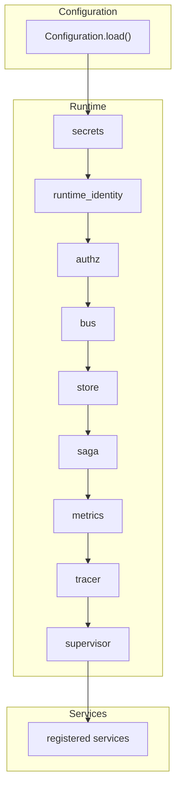

# Runtime

The runtime is the product. Services are domain code; the runtime
is the set of guarantees that domain code receives by construction.

This page is a tour of `underwrite.runtime.Runtime` — the
orchestrator that wires every dependency in the right order, hands
each service the right collaborators, and shuts everything down
cleanly when the context exits.

## What the runtime does



Every arrow is a dependency. The runtime constructs them in
dependency order so that, when the constructor finishes, every
component is in a usable state.

## Lifecycle

### Construction

```python
from underwrite.runtime import Runtime

with Runtime() as runtime:
    runtime.start(["mechanism", "audit"])
    runtime.publish("mechanism", {"command": "ping"})
```

`Runtime(config=None, readonly=False)`:

- Loads configuration from the file in the current directory, or
  the path in `UNDERWRITE_CONFIG`, or default values.
- Configures logging from `Configuration.logging`.
- Builds the store from `Configuration.store`.
- Creates the secrets manager from `Configuration.secrets`.
- Generates (or loads) the runtime Ed25519 identity.
- Builds the authz engine and trusts the runtime identity *before*
  the bus is constructed — events published during construction are
  verified against a trusted key.
- Builds the bus, saga orchestrator, metrics collector, tracer,
  supervisor.
- Registers subsystem health checks.

### Service registration

```python
runtime.register("audit")        # by name
runtime.register("custom", svc)  # by instance
```

`register(name, instance=None)` either instantiates a service by its
name in `HANDLER_MAP` or accepts an externally-built instance. The
service's `__init__` calls `self.subscribe(event_type)` to declare
its subscriptions; the runtime wires those subscriptions with the
bus.

### Starting services

```python
runtime.start(["audit", "mechanism", "pricing"])
```

`start(service_names=None)` spins up the named services (or every
registered service if `None`). The supervisor attaches to each
running service and tracks failures.

### Publishing events

```python
event_id = runtime.publish(
    "mechanism",
    {"command": "add_seed", "user": "hdfc-bank", "base_budget": 10_000_000},
)
```

`publish` constructs a `Message`, signs it with the **runtime
identity**, and dispatches it through the bus.

For services, prefer `self.emit(...)` — the base class signs with
the **service identity** so downstream verifiers see the real
source.

### Stopping

```python
runtime.stop()    # or exit the `with` block
```

`stop()` drains the bus, shuts down the executor, closes the store,
and tears down the tracer and the metrics exporter. After `stop()`,
the runtime is no longer usable.

## Read-only mode

```python
runtime = Runtime(readonly=True)
```

In `readonly=True`, the runtime skips identity, authz, services,
migrations, metrics export, and supervisor. It only wires the
store, the bus, and the health registry. Use it for CLI commands
that need to read state without side effects.

## Construction order

The runtime builds components in a specific order to eliminate
startup races:

1. Configuration loaded
2. Logging configured
3. Store built
4. Runtime identity created
5. **Authz built and runtime identity trusted** ← before the bus
6. KYC provider config resolved
7. Tracer built
8. Bus built
9. Saga orchestrator built
10. Health registry created
11. Metrics collector built
12. Supervisor built

Step 5 is the critical race-prevention step. Authz is built and
the runtime identity is trusted *before* the bus is constructed;
so
that any event the runtime publishes during the rest of construction
is verified against a trusted key.

## Dependencies each service receives

When a service is constructed, the runtime injects the dependencies
it needs:

| Dependency | Source | Required |
|-----------|--------|----------|
| `name` | registration | Yes |
| `identity` | Keypair.create or injected | Yes |
| `bus` | LocalBus (or other EventBus) | Yes |
| `store` | Sqlite (or other Store) | Yes |
| `metrics` | Collector | Optional |
| `health` | Checks | Optional |
| `authz` | AccessControl | Optional |
| `tracer` | ConsoleTracer / OtlpTracer | Optional |
| `saga` | Orchestrator | Optional |
| `supervisor` | Watcher | Optional |
| `secrets_manager` | EnvManager / VaultManager / AwsManager | Optional |

A service that needs only the bus and the store can be
constructed by hand; the runtime is a convenience, not a
requirement.

## Composition

Services compose through the event bus, not through direct calls.
A service that needs data from another service publishes an event
and waits for the response — or, if the response is synchronous,
queries the store.

This is the **only** way services interact. There are no direct
service-to-service imports; the bus is the contract.

## See also

- [Architecture](architecture.md) — the layered design.
- [Events](events.md) — the bus protocol in detail.
- [Failure handling](failure-handling.md) — what the runtime does when something goes wrong.